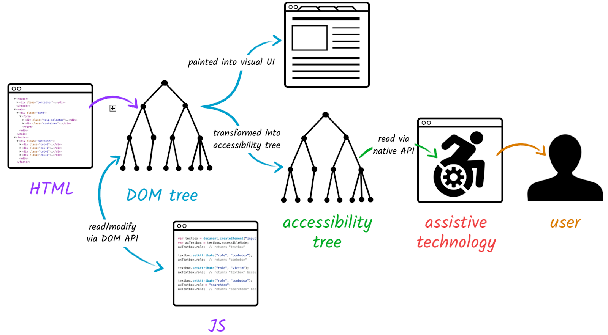

# Accessibility (A11y)

[W3/adapt](https://www.w3.org/WAI/adapt) reglas puestas por web A11Y , el official.
Más amablemente lo explica [DevMozilla/A11y](https://developer.mozilla.org/es/docs/Web/Accessibility)
Están las reglas y las herramientas que ayudan a llevarlas a cabo
[Web.dev/A11y](https://web.dev/accessibility) 

garage de ideas tech hay video de accesibilidad web:que es y como aplicarla

alt, pointer, title, hover, agrandamiento, el idioma
hay que complementar el color con elementos extra
la escalibilidad cuando lo haces más pequeño o más grande

problemas, visuales, motrices, auditivas y las cognitivas

WAI tiene las calificaciones oficiales

WCAG es una lista de pautas 

Beneficios:
-     potenciales visitantes
-     satisfacción de los usuarios
-     costes de desarrollo  
-     manteamiento 
-     tiempo de carga
-     Se mejora SEO

tecnologías asistidas o inclusivas:
- lectores de pantallas
- teclados alternativos
- switches 
- scanning software

Accesibilidad 2.0

Los media query
la semántica html
atributo tabindex="0": hace que sea focusable
la operatividad es decir si es un button funcione como button
el title del head debe tener información de lo que es la pagina y el sitio, blog| nombre de la pagina.
la description
algo deprecado no es que este eliminado es solo que esta obsoleto

Se valida en el back, en el back la validación es seguridad.
Se valida en el front, es UX ayuda al usuario.

semántica html
    organizar la información para el publico y no como lo tienes en tu cabeza
    en los ul solo puede haber li, ni párrafo 
    mirar index.html

elementos de accesibilidad
el rel="" amplia la información interna para las maquinas, se puede poner, si es external, help, preload, prerender etc.. mirar mdnWeb/rel
para los vínculos no solo usar color usar también subrayado por si no ve el color

alt="" ahora se permite ponerlo como cadena vacía

la importancia de focus, si navegas con el teclado, al usar tab solo se puede entrar en donde coge focus tabindex="0", le otorgas foco a los elementos que desees

enlaces vs botones
mirar el 7.accessibility, el readme.md verlo, referencias tiene una lista

repaso resumen
los 4 pilares son :
perceptible
operable
comprensible
robusto

Hay tres niveles

estándares WAI del W3C
Pautas de WCAG 2

elementos de html y css ayudan para ello

ARIA:
una parte de WAI, Accesibilidad Rica Internet Aplicaciones(ARIA) y convertirlas accesibles. Aria seria una semántica añadida para interfaces mas complejos, sean mas especificas.
Aria te permite responder a las tres preguntas, QUE ES, COMO SE ENCUENTRA Y QUE HACE.
ARIA cuenta con los roles y los estados.
Estados:
ARIA es poniendo atributo role=""
Están también los estados y propiedades y todas empiezan por aria-....
Roles:

Árbol de accesibilidad:

la importancia de la semántica de HTML es para la lectura asistida, y si por estética pones muchos divs, aquí entra ARIA. Cuando usar angular, react, usaras ARIA porque son interfaces complejas. 
