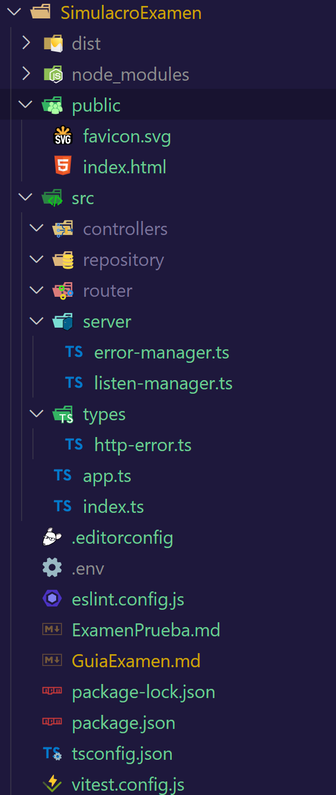

# Pasos para el Examen

configurar el package.json, copiar y pegar seguro que nos deja ya que no estará encima viendo que hacemos


1️⃣Configurar el entorno de trabajo, estructura de carpetas y el package.json

Esta seria la estructura final pero ire paso a paso porque si no para mi mentalmente es mas lioso

Examen/
├── node_modules/                # Módulos instalados con npm
├── prisma/                      # ORM de prisma con los modelos de la BD
├── public/                      # favicon y un html básico de entrada
├── src/
│   ├── config/
│   │   └── database.js          # Conexión a MySQL

│   ├── dto/
│   │   └── DTO.js               # Zod tanto el objeto como el tipado

│   ├── models/
│   │   └── modelo.js            # Definición de la estructura de datos (Modelo)

│   ├── repositories/
│   │   └── Repository.js        # Interacción con MySQL y transformación de datos

│   ├── controllers/
│   │   └── Controller.js        # Lógica de negocio

│   ├── routes/
│   │   └── Routes.js            # Definición de rutas

│   ├── server/
│   │   └── lister-manager.js    # Función de gestión y muestra de dirección
        └── error-manager.js     # Nuestro manejar errores final

│   ├── services/
│   │   └── auth.services.js     # Encargado del login y el registro, comparación de pass y token

│   ├── middlewares/
│   │   └── auth.interceptor.js  # Gestiona la autenticación y autorización en las rutas protegidas de tu aplicación.
        └── debug-logger.js      # Para poder seguir la el flujo de datos en tiempo de ejecución

│   ├── types/
│   │   └── app-response.js      # Tipo genérico en ts
        └── http-error.js        # Clase personalizada de errores HTTP.

│   └── app.js                   # Configura Express y carga las rutas
│   └── index.js                 # Punto de entrada principal

├── .env                         # Variables de entorno (credenciales, puerto, etc.)
├── package.json                 # Información del proyecto y dependencias
└── README.md                    # Documentación del proyecto


## Primero Crear la base de datos

Creando la base de datos, seria entrar en MySQL y crear en schema ya sea con el interface o a traves de comandos de MySql y comprobar que se ve y se creo adecuadamente.

Lo primero es crear el schema(library), luego la tabla con las columnas que tendrán
```sql
CREATE TABLE books (
    book_id CHAR(36) PRIMARY KEY DEFAULT (UUID()),  -- ID único tipo UUID
    title VARCHAR(255) NOT NULL UNIQUE,            -- Título único
    author VARCHAR(255) NOT NULL,                   -- Autor del libro
    year INT NOT NULL,                              -- Año de publicación
    genre VARCHAR(100) NOT NULL,                    -- Género del libro
    available BOOLEAN NOT NULL DEFAULT TRUE,        -- Disponibilidad

    UNIQUE (title, year),  -- Restricción de unicidad en título y año
    INDEX (title)          -- Índice en el título para búsquedas rápidas
);
```
y por ultimo introducir los libros 

```sql
INSERT INTO books (book_id, title, author, year, genre, available) VALUES
    (UUID(), 'El nombre del viento', 'Patrick Rothfuss', 2007, 'Fantasía', true),
    (UUID(), 'Dune', 'Frank Herbert', 1965, 'Ciencia ficción', true),
    (UUID(), '1984', 'George Orwell', 1949, 'Distopía', false),
    (UUID(), 'Los juegos del hambre', 'Suzanne Collins', 2008, 'Juvenil', true),
    (UUID(), 'Fundación', 'Isaac Asimov', 1951, 'Ciencia ficción', true),
    (UUID(), 'Crónica del pájaro que da cuerda al mundo', 'Haruki Murakami', 1994, 'Ficción contemporánea', true),
    (UUID(), 'El problema de los tres cuerpos', 'Liu Cixin', 2008, 'Ciencia ficción', true),
    (UUID(), 'Cien años de soledad', 'Gabriel García Márquez', 1967, 'Realismo mágico', true),
    (UUID(), 'Los pilares de la Tierra', 'Ken Follett', 1989, 'Novela histórica', true),
    (UUID(), 'Neuromante', 'William Gibson', 1984, 'Cyberpunk', false);


```
comprobar que se ven los libros desde MYSql workbrench


## Segundo Levantar el servidor sin rutas

**Estructura** minima y  npm i, configurar el .env y el package.json, para que lee los debug segun el nombre que desees para que lea la tabla

library/
    ├── public/
    │   ├── favicon
        ├── html sencillo
    ├── src/
    │   ├── controllers/
    │   ├── repo/
    │   ├── router/
    │   ├── server/
    │   ├── app.ts
    │   └── index.ts
    ├── .env
    └── package.json


**Primero** es crear el archivo app.js

```js
Archivo app.ts

import express from 'express';
import { resolve } from 'path';
import morgan from 'morgan';
import cors from 'cors';
import createDebug from 'debug';


const debug = createDebug('library:app');

debug('Loaded module app');

export const createApp = () => {
    debug('Iniciando App');

    const app = express();
    const __dirname = resolve(); 
    const publicPath = resolve(__dirname, 'public');

    app.disable('x-powered-by');

    app.use(cors());

    if (!process.env.DEBUG) {
        app.use(morgan('dev'));
    }

    app.use(express.json());
    app.use(express.urlencoded({ extended: true }));
    app.use(express.static(publicPath));


    return app


}

```


**Segundo** index.ts

```js

import { createServer } from 'node:http';
import createDebug from 'debug';
import { listenManager } from './server/listen-manager.js';
import { errorManager } from './server/error-manager.js';
import { createApp } from './app.js';

const debug = createDebug('library:server');
debug('Iniciando servidor...');
const PORT = process.env.PORT || 3000;

try {
    const server = createServer(createApp());
    server.listen(PORT);
    server.on('listening', () => listenManager(server));
    server.on('error', errorManager);
} catch (err) {
    console.error('Server Error:', err);
    process.exit(1);
}

Ahora debemos crear listenerManager y errorManager para tener el mínimo para que el server pueda escuchar un puerto, gestionar un mínimo de error durante la conexión

```

**Tercero** 

 │   ├── server/
          ├── error-manager.ts
          ├── listen-manager.ts

```js
listen-manager

import createDebug from 'debug';
import { Server } from 'node:http';
const debug = createDebug('library:server:listening');

export const listenManager = (server: Server) => {
    const addr = server.address();
    if (addr === null) return;
    let bind: string;
    if (typeof addr === 'string') {
        bind = 'pipe ' + addr;
    } else {
        bind =
            addr.address === '::'
                ? `http://localhost:${addr?.port}`
                : `${addr.address}:${addr?.port}`;
    }
    if (!process.env.DEBUG) {
        console.log(`Server listening on ${bind}`);
    } else {
        debug(`Servidor escuchando en ${bind}`);
    }
};

```

**cuarto**

```js

error-manager

Se quejara de HttpError

import type { ServerResponse } from 'node:http';
import { HttpError } from '../types/http-error.js'; //necesitamos hacer el tipado
import createDebug from 'debug';
const debug = createDebug('library:server:errors');

export const errorManager = (
    error: Error | HttpError,
    response: ServerResponse,
) => {
    if (!('status' in error)) {
        error = {
            ...error,
            statusCode: 500,
            status: 'Internal Server Error',
        };
    }

    const publicMessage = `Error: ${error.statusCode} ${error.status}`;
    debug(publicMessage, error.message);

    const html = `<p>${publicMessage}</p>`;
    response.statusCode = error.statusCode;
    response.statusMessage = error.status;
    response.setHeader('Content-Type', 'text/html; charset=utf-8');
    response.end(html);
};


```

**quinto**
nueva carpeta
  ├── types/
          ├── http-error.ts

``` js

export class HttpError extends Error {
    constructor(
        message: string,
        public statusCode: number,
        public status: string,
    ) {
        super(message);
        this.name = 'HttpError';
    }
}


```




Hasta aquí se debería poder levantar el servidor escuchar el puerto 3000 de localhost y desde app leer el html básico, escribir algo para verificar antes de comenzar con las rutas

## Rutas  error de la req y formato de la res(response)

Recordatorio el flujo de datos de la req, es desde el front hago una petición al back *req* y al entrar mi *req* recibe crea una *res* vacía que cuando se llena con la solicitud del *req* se devuelve o si hay algo mal se devuelve en ese instante.
Asi que la primera capa de la *req* es *app*, luego pasamos al *router*, de ahí al *controller* y por ultimo al *repo*.


 **Primero** volvemos a app e integramos las nuevas rutas una que lleve al router y gestión de errores 
```js
Obviamente se estará quejando porque aun no lo hemos creado, la secuencia de creación puede ser inversa de abajo a arriba o de arriba ha abajo, lo correcto seria de lo más profundo a lo menos profundo pero creo que es mas lioso si no se tiene una estructura totalmente definida en tu cabeza, es mejor ir por necesidades, ahora necesitamos gestionar rutas y nos faltan los archivos así que vamos a crearlos después de incorporar el código de acontinuacion

app.use('/api/books', booksRouter);
app.get('*', notFoundController); //método de consulta get lanza un 404//cuando no encuentra la ruta lo envía a notFoundController que esta en base controller y este lo envía a error controllers que tiene el manager de errores
app.use('*', notMethodController); // cualquier protocolo que no sea get lo envía a notMethodController que esta en base controller y este lo envía a error controllers que tiene el manager de errores
app.use(errorManager)

```

**segundo** Los controllers de error por si las peticiones desde el front son erróneas

 ├── src/
    │   ├── controllers/
                ├── controller.base.ts


```js 

import type { NextFunction, Request, Response } from 'express';
import createDebug from 'debug';
import { HttpError } from '../types/http-error.js';

export const notFoundController = (
    req: Request,
    _res: Response,
    next: NextFunction,
) => {
    const debug = createDebug('library:notFoundController');
    debug('Petición recibida');

    const message = `Page ${req.url} not found`;
    const error = new HttpError(message, 404, 'Not Found');
    next(error);//Esto lo envía a errorManager archivo errors.controller.ts
};

export const notMethodController = (
    req: Request,
    _res: Response,
    next: NextFunction,
) => {
    const debug = createDebug('library:notMethodController');
    debug('Petición recibida');

    const message = `Method ${req.method}  not allowed`;
    const error = new HttpError(message, 405, 'Method Not Allowed');
    next(error);
};


```

├── src/
    │   ├── controllers/
                ├── controller.error.ts


```js
import { Request, Response, NextFunction } from 'express';
import createDebug from 'debug';
import { HttpError } from '../types/http-error.js';
import { AppResponse } from '../types/app-response.js'; //este no esta creado aun
import {
    PrismaClientKnownRequestError,
    PrismaClientValidationError,
} from '@prisma/client/runtime/library.js';
// import { ErrorPage } from '../views/pages/error-page.js';

const debug = createDebug('library:errorManager');

export const errorManager = (
    err: HttpError | Error,
    _req: Request,
    res: Response,
    // eslint-disable-next-line @typescript-eslint/no-unused-vars
    _next: NextFunction,
) => {
    if (err instanceof PrismaClientKnownRequestError) {
        err = {
            ...err,
            cause: `Prisma Code ${err.code} in ${err.meta?.modelName} model`,
            message: (err.meta?.cause as string) || '',
            statusCode: 400,
            status: 'Bad Request',
        };
    } else if (err instanceof PrismaClientValidationError) {
        err = {
            ...err,
            cause: 'Prisma validation error',
            message: err.message || '',
            statusCode: 400,
            status: 'Bad Request',
        };
    } else if (!('status' in err)) {
        console.error(err);
        err = {
            ...err,
            statusCode: 400,
            status: 'Bad Request',
        };
    }

    const publicMessage = `Error: ${err.statusCode} ${err.status}`;
    debug(publicMessage, err.message, err.cause);

    res.status(err.statusCode);
    res.setHeader('Content-Type', 'text/html; charset=utf-8');

    const response: AppResponse<unknown> = {
        results: null,
        error: publicMessage,
    };

    res.json(response);
};


```

Aquí añadimos un tipado más que es para la response, es decir la res que queremos devolver

 ├── types/
          ├──app-response.ts


```js
añadimos un archivo app-response.ts
export type AppResponse<T> = {
    results: T[] | null;
    error: string;
};

```


Nos quedaría esto

├── src/
    │   ├── controllers/
                ├── controller.base.ts
                ├── controller.error.ts
         ├── types/
              ├──app-response.ts
              ├── http-error.ts //Este ya estaba al completar el primer paso entero


  
Ahora ya solo queda el router para que en app nos deje de chillar esta linea comentar
```js
app.use('/api/books', booksRouter);
```


## router, controller y repo

Ahora empezamos con lo que determino la clave de entender y lo mas difícil porque nos vamos moviendo por capas dando saltos por lo que se necesita, por como funciona el flujo ya que a partir de ahora los componente se comunican entre ellos por la interacción de multiples capas a la vez a traves de la inyección de dependencias y esto poco a poco se va complicando a lo largo de todo el proyecto.

Aquí por comodidad hacemos un cambio en la trayectoria de creación ante la realidad del flujo, el flujo es la req entra a app, pasa a router, este con la inyección de dependencias usa las métodos de controller concretos , el controller tiene la inyección con repo y al igual utiliza los métodos concretos que tiene repo según la req es decir la petición, y por ultimo el repo la capa más profunda tiene los métodos últimos que conecta con la base de datos y hace el CRUD.

Esquema de lo explicado
La req entra a app.ts → Middleware, validaciones generales.
Llega a router → Define qué controller manejará la petición.
El controller recibe la req → Aplica lógica de negocio y usa repo.
El repo accede a la base de datos → Interactúa con Prisma para hacer el CRUD.
El controller envía la res con los datos al usuario.

### **Primero**  Crear el repository 

Que necesitamos para el repository:

-   Tener prisma aquí que es el ORM 
-   Tener un modelo de datos en el cliente de prisma
-   Tener un DTO con Zod que es un tipado y un objetos( solo usaremos el tipado aquí)
-   Tener interfaz repository genérico
  
Pasos a seguir para instalar prisma  (Ya tenemos la tabla en mysql manualmente)

-   npx prisma init (para que se haga la carpeta con schema.prisma)
-   configurar el .env y schema.prisma
-   npx prisma db pull (para traer el modelo de la base de datos)
-    
```prisma
generator client {
  provider = "prisma-client-js"
}

datasource db {
  provider = "mysql"
  url      = env("DATABASE_URL")
}

model books {
  id        String  @id @default(uuid()) @map("book_id")
  title     String  @unique(map: "title") 
  author    String  
  year      Int
  genre     String  
  available Boolean @default(true)

  @@unique([title, year])
  @@index([title])
  @@map("books")
  
}

```
 📌 Pasos finales
1️⃣ Ejecutar npx prisma db push para sincronizar Prisma con MySQL.
2️⃣ Ejecutar npx prisma generate para asegurarte de que el cliente Prisma está actualizado.


Todo esto es para poder incorporar el primer import 
```js
import { Books, PrismaClient } from '@prisma/client';

```
Vamos a por el interfaz genérico que básicamente es para garantizar que todas las clases que se implementen esta interfaz tengan los métodos CRUD con la misma estructura.

```js
archivo repository.type.ts

export interface Repository<T> {
    read: () => Promise<T[]>;
    readById: (id: string) => Promise<T>;
    create: (data: Omit<T, 'id'>) => Promise<T>;
    update: (id: string, data: Partial<Omit<T, 'id'>>) => Promise<T>;
    delete: (id: string) => Promise<T>;
}
```
y ahora ya el ultimo paso antes de empezar ya por fin con el repository, queda el dto con zod

```ts
archivo books.dto.ts

import { Prisma } from '@prisma/client';
import { z } from 'zod';
import createDebug from 'debug';

const debug = createDebug('books:DTO:book');
debug('Instanciando module');


export const BookCreateDTO = z.object({
    title: z.string().nonempty(),
    author: z.string().nonempty(),
    year: z.number().int().positive(),
    genre: z.string().nonempty(),
    available : z.boolean(),
}) satisfies z.Schema<Prisma.BooksCreateInput>;

export type BookCreateDTO = z.infer<typeof BookCreateDTO>;

```

ya por fin podemos configurar por completo el archivo repo

```js 
Archivo books.repository.ts

import { Books, PrismaClient } from "@prisma/client";
import { Repository } from "./repository.type";
import { BookCreateDTO } from "../dto/books.dto";
import createDebug from 'debug';

const debug = createDebug('library:repository:books');


export class BookRepo implements Repository<Books> {
    prisma: PrismaClient; // Conexión a la base de datos hecha por prisma
    constructor() {
        debug('Instanciando repo for books');
        this.prisma = new PrismaClient();
    }
    async read(): Promise<Books[]> {
        const books = await this.prisma.books.findMany();
        return books;
    }
    async readById(id: string): Promise<Books> {
        const book = await this.prisma.books.findUniqueOrThrow({
            where: {id},
        });
        return book;
    }
    async create(data: BookCreateDTO): Promise<Books> {
        const book = await this.prisma.books.create({
            data,
        });
        return book;
    }
    async update (id: string
        , data: Partial<BookCreateDTO>,
    ): Promise<Books> {
        const book = await this.prisma.books.update({
            where: {id},
            data,
        });
        return book;
    }
    async delete(id: string): Promise<Books> {
        const book = await this.prisma.books.delete({
            where: {id},
        });
        return book;
    }
}

```

### **Segundo** Crear el controller

He aumentado la posibilidad de Zod y los tipado y he aumentado mas tipado y objetos para poder hacer una comprobación desde todas las rutas así que aumento el tipado.

```js
añado esto

export const BookIdDTO = z.object({
    id: z.string().uuid(),
});
export type BookIdDTO = z.infer<typeof BookIdDTO>;


export const BookUpdateDTO = BookCreateDTO.partial();
export type BookUpdateDTO = z.infer<typeof BookUpdateDTO>;


```

```js

archivo book.controller.ts

import { Request, Response, NextFunction } from 'express';
import { Repository } from '../repository/repository.type.js'
import { Books } from "@prisma/client";
import { BookCreateDTO, BookIdDTO, BookUpdateDTO } from '../dto/books.dto.js';
import createDebug from 'debug';
import { AppResponse } from '../types/app-response.js';

const debug = createDebug('library:controller:books');


export class BooksController {
    constructor(private repoBooks: Repository<Books>) {
        debug('Instanciando ');
    }
    //como el controller es el encargado de devolver la respuesta, le pasamos el res final
    private makeResponse(results: Books[], error?: string) {
        const data: AppResponse<Books> = {
            results,
            error: error || '',
        };
        return data;
    }

    getAll = async (req: Request, res: Response, next: NextFunction) => {
        try {
            const books = await this.repoBooks.read();
            res.json(this.makeResponse(books));
        } catch (error) {
            next(error);
        }
    };
    getById = async (req: Request, res: Response, next: NextFunction) => {
        try {
            const { id } = BookIdDTO.parse(req.params);
            const book = await this.repoBooks.readById(id);
            res.json(this.makeResponse([book]));
        } catch (error) {
            next(error);
        }
    };
    create = async (req: Request, res: Response, next: NextFunction) => {
        try {
            debug(req.body);
            BookCreateDTO.parse(req.body);
            const newData: BookCreateDTO = req.body;
            const book = await this.repoBooks.create(newData);
            res.json(this.makeResponse([book]));
        } catch (error) {
            next(error);
        }
    };
    update = async (req: Request, res: Response, next: NextFunction) => {
        try {
            const { id } = req.params;
            BookUpdateDTO.partial().parse(req.body);
            const newData: BookUpdateDTO = req.body;
            const book = await this.repoBooks.update(id, newData);
            res.json(this.makeResponse([book]));
        } catch (error) {
            next(error);
        }
    };
    delete = async (req: Request, res: Response, next: NextFunction) => {
        try {
            const { id } = req.params;
            const book = await this.repoBooks.delete(id);
            res.json(this.makeResponse([book]));
        } catch (error) {
            next(error);
        }
    };
}


```


### **Tercero** Crear el router

```js
archivo bookRouter.js

import { Router } from "express";
import createDebug from 'debug';
import { BooksController } from "../controllers/books.controller.js";
const debug = createDebug('books:router:books');


export const createBooksRouter = (
    booksController: BooksController,
) => {
    debug('Configurando router de books');
    const booksRouter = Router();
        booksRouter.get('/', booksController.getAll);
        booksRouter.get('/:id', booksController.getById);
        booksRouter.post('/create', booksController.create);
        booksRouter.patch('/:id', booksController.update);
        booksRouter.delete('/:id', booksController.delete);
    return booksRouter;

}

```

### **Cuarto** integración de los componentes desde app 

Este paso es la clave de que todo funcione, de que se comuniquen las capas adecuadamente:


```js
    const booksRepo = new BookRepo();
    const booksController = new BooksController(booksRepo);
    const booksRouter = createBooksRouter(booksController);


    app.use('/api/books', booksRouter);
```

📌 Esquema de Inyección de Dependencias
1️⃣ Repositorio (Repo) → Se encarga de la conexión con la base de datos y los métodos CRUD.

2️⃣ Controlador (Controller) → Recibe el Repo como dependencia para usar sus métodos y manejar la lógica de negocio.

3️⃣ Router (Router) → Recibe el Controller, define las rutas y las conecta con los métodos del Controller.

📌 Relación entre capas:

Controller usa Repo para acceder a los datos.
Router usa Controller, que ya tiene el Repo inyectado.
App.ts instancia todo y registra las rutas

**CRUD** terminado, comprobar todo con postman.

Hasta aquí están estos puntos hechos:
1️⃣Configuración del Entorno
2️⃣Base de Datos (Prisma ORM)
3️⃣API REST con Express


## Autenticación de Usuarios


